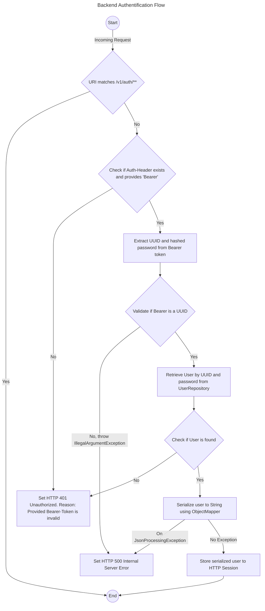

# Backend

## Getting started

> [!NOTE]  
> This backend is build on **JDK version 17.0.8**

> [!NOTE]  
> You can find the database and docker-compose.yml in the [setup repository](https://github.com/budgetbuddyde/setup).


### Docker

#### Pull or push

```bash
echo <GH_PAT> | docker login ghcr.io -u <GH_USER> --password-stdin
docker pull ghcr.io/budgetbuddyde/backend:latest
# or
docker push ghcr.io/budgetbuddyde/backend:latest
```

#### Build

```bash
docker build . -t ghcr.io/budgetbuddyde/backend:latest
```

#### Run

```bash
docker run -p 80:8080 ghcr.io/budgetbuddyde/backend:latest
```

## Authentification

> [!IMPORTANT]  
> The `Authorization` header should be structured as follows.
>
> `Bearer: UUID.HASHED_PASSWORD`
>
> The values are separated and then verified in the `AuthorizationInterceptor`. The current user for the session is then determined based on the UUID and set as the "user" session attribute.

